# Openstrap Edge

An app that makes your wearable useful without its subscription. Pairs over Bluetooth, computes everything on your phone, iOS and Android. WHOOP 4/5/MG get full support today; see [Supports](#supports) for what else it talks to.

[](https://github.com/OpenStrap/edge/actions/workflows/test.yml)
[](LICENSE)
[](https://testflight.apple.com/join/2BVSwq65)
[](https://github.com/OpenStrap/edge/releases/latest)
[](https://github.com/OpenStrap/edge/releases)
[](https://github.com/OpenStrap/edge/stargazers)
[](https://discord.gg/dUXds5MWkd)
[](DONATE.md)

> Not affiliated with WHOOP. Not a clone of their app or their scores — see below.


## As featured in

> **"The goal of the so-called OpenStrap project is not to re-create the WHOOP app.
> Rather, the algorithms and processing methods are developed from scratch, based on
> public research… The health data collected from the watch never leaves the phone."**
>
> — [**Hackaday**, 15 July 2026](https://hackaday.com/2026/07/15/making-a-locked-down-wearable-work-without-a-subscription/)

> **"When a membership lapses, the hardware is basically useless. You own it, you still
> can't use it — it just goes dark, because the app stops talking to it. So you've got a
> perfectly good sensor turning into a paperweight."**
>
> — [**Adafruit**, 15 July 2026](https://blog.adafruit.com/2026/07/15/openstrap-edge-makes-a-whoop-4-0-band-useful-without-a-subscription/)

## Install

| | |
|---|---|
| **iOS** | **[Join the TestFlight beta →](https://testflight.apple.com/join/2BVSwq65)** — normal TestFlight install, no sideloading, no computer needed. |
| **Android** | **[Download the APK →](https://github.com/OpenStrap/edge/releases/latest)** — allow installs from unknown sources and open it. |

Quit the official WHOOP app before you pair. Bluetooth only lets one app own the
band at a time.

Prefer to sideload the unsigned IPA instead of using TestFlight? That still
works — see [`guides/IOS_SIDELOAD.md`](guides/IOS_SIDELOAD.md).

---

<div align="center">

### ☕ Like it? Help keep it going.

**No subscription, no paywall, no company behind this.**<br>
If OpenStrap gave your band a second life, a small tip genuinely helps.

**Bitcoin**

`bc1qvtcch38dcwp967ar764uu6eetw7tf907844wfq`

**EVM** — Ethereum · Base · Arbitrum · Optimism · Polygon

`0x8310C89393366b7eBCD47ABa82e1dfB5ECeFFbD9`

[**What donations actually pay for →**](DONATE.md)

*Nothing is gated behind paying, and nothing ever will be.<br>
Bug reports from real bands are worth more than money — there's only one
person's physiology in the test data otherwise.*

</div>

---

## What made me build this app 

My subscription lapsed and a perfectly good sensor turned into a bracelet. The hardware
never stopped working, only the app that made it useful did. So I reverse-engineered
enough of the band's Bluetooth protocol to talk to it myself, wrote the analytics from
scratch off published research instead of guessing at WHOOP's formulas, and built an app
around the result. Now it works without them, and anyone else stuck with the same
drawer-bracelet problem can use it, or go dig through the code themselves.

## Checklist

- Pairs, syncs, and decodes WHOOP 4.0, WHOOP 5, and MG. WHOOP 4.0 gets the most daily
  wear-testing since that's what's on my wrist — open an issue if 5 or MG does something
  wrong.
- Not affiliated with WHOOP, doesn't talk to their servers.
- Not a clone of their algorithms — different math, published methods, cited in the
  analytics repo. Don't expect identical numbers to what their app shows.
- There are bugs. Some I know about, more I probably don't. Open an issue if something
  looks wrong.
- **Don't bounce between this and the official WHOOP app.** A firmware push from their
  app could change the records this one depends on, and there's no fixing that from here.
  Pick one and stay on it.

## Screens

| | | |
|:--:|:--:|:--:|
| 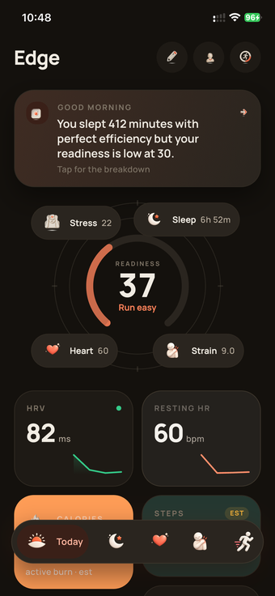<br>**Today** | 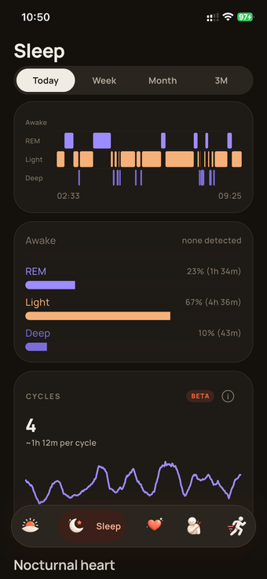<br>**Sleep** | 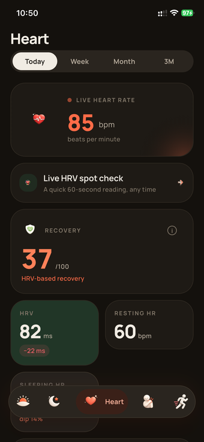<br>**Heart** |
| 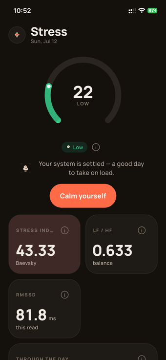<br>**Stress** | 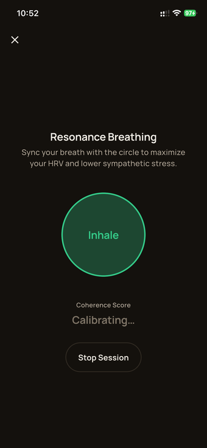<br>**Breathing** | 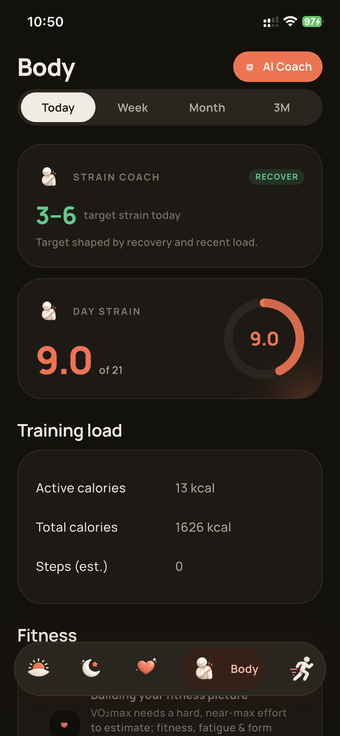<br>**Body** |
| 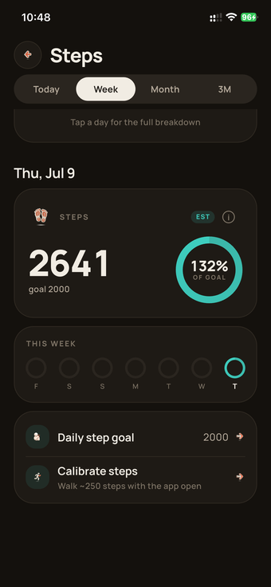<br>**Steps** | 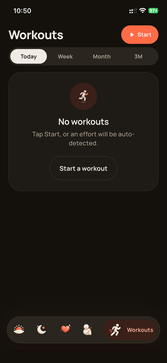<br>**Workouts** | 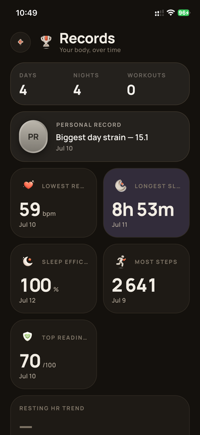<br>**Records** |
| 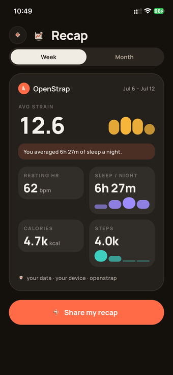<br>**Recap** | 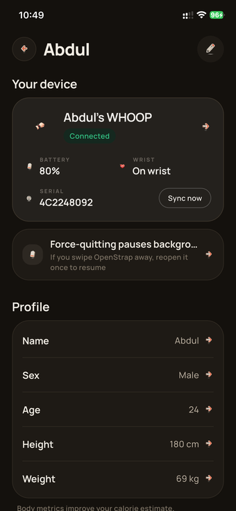<br>**Profile** | |

iOS also gets a home-screen widget, a lock-screen/Dynamic Island Live Activity, and a
couple of Siri shortcuts.

| | | |
|:--:|:--:|:--:|
| 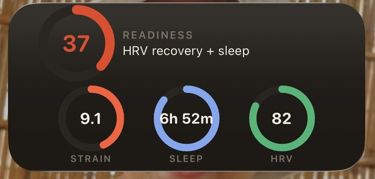<br>**Widget** | 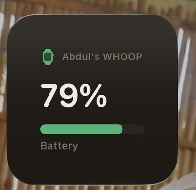<br>**Battery widget** | 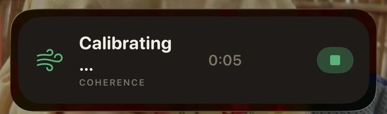<br>**Live Activity** |

Every screenshot above is real output from a WHOOP 4.0. 

## Supports

- **WHOOP 4, WHOOP 5, MG** — full support. Everything below is computed from these.
- **Any standard Bluetooth heart-rate strap** — pairs for workout tracking today (heart
  rate + beat timing, stored and shown). Feeding it into recovery/strain is on the roadmap.
- **Oura Ring** — protocol groundwork exists in the codebase; not pairable in the app yet.

## What works

**Health** — heart rate, HRV, sleep staging, recovery/readiness, strain, stress, an HRV
spot-check, VO2max estimate, real-time breathing coherence.

**Activity** — auto-detected workouts, live workout tracking with GPS routes, heart-rate
zones you can edit manually, GPX export.

**Your data, elsewhere** — writes to **Apple Health** (HealthKit) and **Google Health
Connect**: sleep stages, resting HR, HRV, respiratory rate, active energy and workouts.
Only things the band actually measures — never the derived scores, which have no native
type and would be fabricated. Exports are idempotent, so a day re-deriving never
duplicates samples. You can also export the entire local SQLite database to a file
whenever you like — it's your data, in a format anything can open.

**Background sync** — the band drains without you opening the app. Android runs a
foreground service with a 15-minute watchdog worker and re-attaches via
CompanionDeviceManager. iOS uses a background processing task plus a light refresh task,
and a separate restore Bluetooth central that relaunches the app when the band
reconnects.

**Everything else** — trends/history, a journal with on-device correlation insights
("what actually moves your numbers"), lab-result CSV import, cycle tracking, a
deterministic coach, a shareable weekly recap, a BYOK AI assistant, home-screen widgets,
iOS Live Activities, Siri shortcuts, a smart alarm that buzzes the band with a weekly
repeating schedule and a smart wake window that catches you in light sleep.

## What doesn't work (yet, or maybe ever)

- iOS background sync is best-effort. It genuinely works (see above), but Apple doesn't
  give third-party apps a real background-service option, so the OS decides when those
  tasks actually run. Syncing while you haven't opened the app in a while is "usually,"
  not "always." Android has no such limit.
- Metrics are approximations off published research — not medical-grade, not validated
  against a lab, don't treat any of it as a diagnosis.
- Not on the App Store or Play Store yet. iOS is a public TestFlight beta, which is a
  normal install but still a beta; Android is an APK straight off Releases.
- WHOOP 5 and MG support is newer than 4.0's and hasn't had as many bands, firmwares,
  and daily hours put on it. Expect the occasional rough edge, and open an issue when
  you hit one.

## Run it

```bash
git clone https://github.com/OpenStrap/edge.git
cd edge
cp .env.example .env
flutter pub get
flutter run --dart-define-from-file=.env
```

Quit the official WHOOP app before you pair — Bluetooth only lets one app own the band at
a time. iOS signing and the App Group setup for the widget/Live Activity is its own
longer story — see `guides/IOS_INSTALLATION.md`.

## How it works

```
wearable → Bluetooth → protocol decoder → local storage → analytics → the UI
```

- `openstrap_protocol` turns bytes off the band into records.
- `openstrap_analytics` turns those records into metrics, each with its own confidence
  score attached — nothing gets faked when the data isn't there.
- this repo is the glue: Bluetooth reliability, local storage (versioned, so an algorithm
  update never silently overwrites old results), background sync, the UI.
- everything that matters stays on the phone.

## Complex Bluetooth protocol

The band doesn't have a normal documented API — it's a proprietary protocol, and getting
it to behave reliably took a while. Short version: the clock ships unset (skip setting it
and every timestamp comes out garbage), history comes off in batches that need an exact
8-byte token echoed back or the band just re-sends the same data forever, and the local
save has to happen before that acknowledgement goes out, not after, so a crash mid-sync
can't lose anything.

The full blow-by-blow lives in the [protocol repo's
README](https://github.com/OpenStrap/protocol) — genuinely the more interesting read if
you're into this kind of thing.

## Your data stays on your phone

Everything's computed and stored locally. No cloud account required, no backend this
needs to work day to day. **Your health data never leaves the device unless you
explicitly send it somewhere.**

Being precise about the network, since "no cloud" gets said too loosely. Nothing below
is required for the app to work, and none of it carries health data except the two you
turn on yourself:

- **Anonymous diagnostics** (Firebase crash/performance). **Off by default in every
  build** — nothing is collected until you turn it on in your profile, and switching
  it back off stops collection immediately. Never includes health data.
- **OTA/announcement pointer** — checks whether there's a newer build.
- **Legacy account import** — one-time, only if you had an old OpenStrap cloud account.
- **BYOK AI assistant** — only if you configure a provider. Your key, your account. Be
  aware that **the prompts contain your health data**: to answer "why is my recovery
  low", the assistant is given your metrics to read. That data goes to whichever
  provider you chose, under their policies, not ours.
- **Health-data contribution** — opt-in, off by default, GitHub builds only. Uploads
  your local database wholesale, which is the entire point of it. It's the only thing
  here that sends the whole database rather than a slice.

Full detail in [PRIVACY.md](PRIVACY.md).

## Repo layout

```
lib/ai/        BYOK AI assistant — briefings, journal AI, nightly sweep
lib/ble/       Bluetooth link + history-sync state machine
lib/cloud/     optional companion/backend + cloud import clients
lib/coach/     read-only SQL coach over allow-listed views
lib/compute/   runs the analytics pipeline, writes results
lib/data/      local storage + the repository seam the UI reads from
lib/debug/     debug-mode flags
lib/gestures/  device action / gesture dispatch
lib/gps/       GPS route tracking for outdoor activities
lib/health/    HealthKit / Health Connect import + export
lib/import/    backup + third-party data import
lib/l10n/      translations (.arb)
lib/live/      Live Activity / breathing session
lib/models/    shared data models (Metric, payloads, app status)
lib/notify/    the single notification emitter + alert policies
lib/platform/  platform-channel glue (app icon, Tasker, device actions)
lib/state/     AppState, the one source of truth
lib/stress/    guided-breathing session logic
lib/sync/      background/headless sync policies
lib/telemetry/ opt-in error + usage telemetry
lib/theme/     design tokens, theming, transitions
lib/ui2/       every screen
lib/widget/    App-Group snapshot for the home-screen/watch widget
```

See `AGENTS.md` §2 for the full architecture map, invariants, and the biggest
files by ownership.

Protocol decoding and analytics live in their own repos —
[protocol](https://github.com/OpenStrap/protocol),
[analytics](https://github.com/OpenStrap/analytics).

## Guides

- [`guides/IOS_INSTALLATION.md`](guides/IOS_INSTALLATION.md) — building and installing on an iPhone.
- [`guides/IOS_SIDELOAD.md`](guides/IOS_SIDELOAD.md) — sideloading without a paid developer account.
- [`guides/WATCH_SETUP.md`](guides/WATCH_SETUP.md) — the Apple Watch companion app.
- [`guides/AI_COACH.md`](guides/AI_COACH.md) — bring-your-own-key AI coach, briefings, and journal.
- [`guides/TASKER_INTEGRATION.md`](guides/TASKER_INTEGRATION.md) — buzzing the strap from Tasker/automation.
- [`guides/BUZZ_MEANINGS.md`](guides/BUZZ_MEANINGS.md) — what each buzz pattern means.

## Community

[Discord](https://discord.gg/dUXds5MWkd) — for questions, band-specific quirks, and
bug reports that don't need a full issue yet.

## Contributing

Found something broken? Open an issue. Found something broken and fixed it? Even better,
send the PR. Protocol-level stuff (new record types, opcodes) belongs in the protocol
repo, metric/formula changes belong in analytics, anything about the app itself —
Bluetooth, storage, UI — belongs here.

[**CONTRIBUTING.md**](CONTRIBUTING.md) has the details: which repo a change belongs in,
how to run the three packages together locally, and the two rules that matter most —
never fabricate a number when the data isn't there, and cite the published method you're
implementing.

Security problems shouldn't go in a public issue — see [SECURITY.md](SECURITY.md) for
private reporting.

## Contributors

Every one of these people made the app better — mostly by using it on a real
wrist and reporting what came out wrong.

<a href="https://github.com/OpenStrap/edge/graphs/contributors">
  
</a>

The most useful contribution isn't necessarily code. There's one person's
physiology in the test data, so a bug report from a different body on a
different band is worth a great deal — see
[`CONTRIBUTING.md`](CONTRIBUTING.md).

## Star history

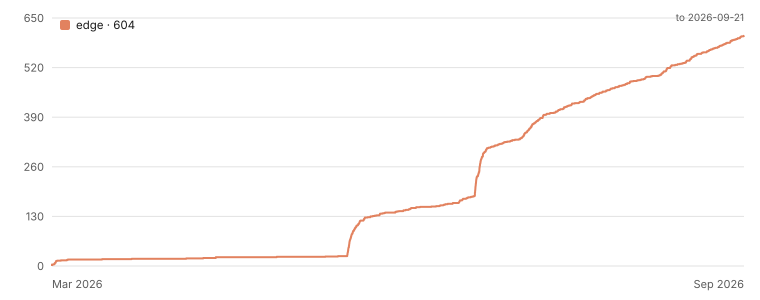

That cliff in mid-July is [Hackaday](https://hackaday.com/2026/07/15/making-a-locked-down-wearable-work-without-a-subscription/)
and [Adafruit](https://blog.adafruit.com/2026/07/15/openstrap-edge-makes-a-whoop-4-0-band-useful-without-a-subscription)
covering it on the same day.
